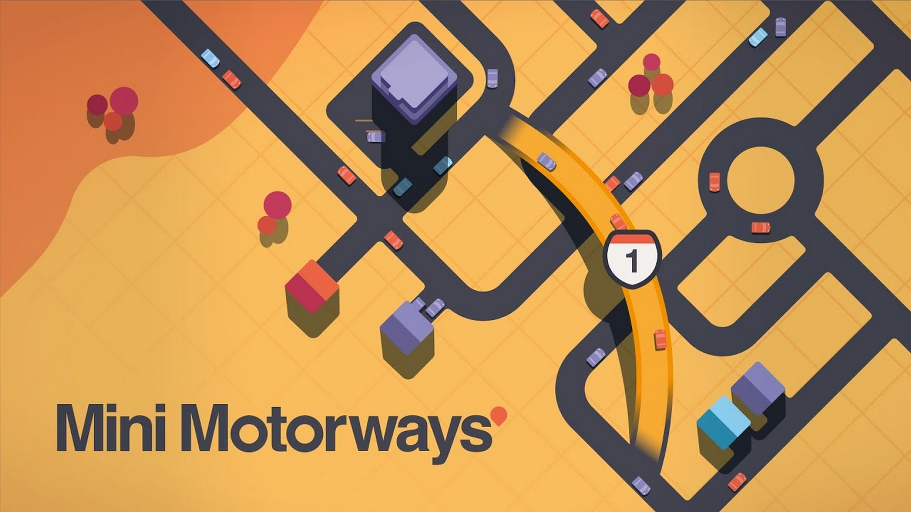
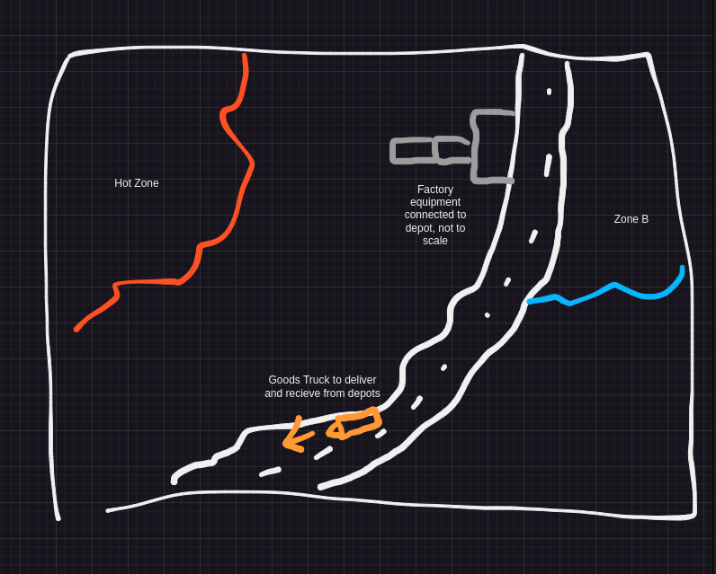

+++
title = 'Game Design Document'
date = 2024-12-11T05:54:14+00:00
tags = ['TastyFactory']
+++
## What Is TastyFactory?
TastyFactory is a 3d factory automation game, where players will work to create an increasingly complex food factory while protecting it against mishaps and disasters that will work against them. The game blends the `satisfaction` of creating an optimized system in games like [satisfactory](https://store.steampowered.com/app/526870/Satisfactory/) with the simplified, approachable look as well as the simple yet addictive gameplay of games like [mini motorways](https://store.steampowered.com/app/1127500/Mini_Motorways/).

## [Design Pillars](https://www.gamedeveloper.com/design/fourteen-forms-of-fun)
| **Problem Solving** | **Creation** | **Advancement and Completion** |
|---|---|---|
| Players should find pleasure in creating `efficient` solutions to generate food to sell and thus money to grow their factory | Players should enjoy the feeling of creating their own factory from nothing and they should feel a sense of `pride` over their factory, the game should not lead them in any one direction | Players should feel a sense of `progression` from unlocking more machines as well as seeing their factory grow bigger and bigger like in [Kingdoms and Castles](https://store.steampowered.com/app/569480/Kingdoms_and_Castles/) |
## Core Gameplay
The player starts off with an empty open environment in which they can place down their `depot` near a road, from which they will receive and send goods.\
Food if left outside to the environment for too long may go bad or have other adverse effects.\
Different `environments` may provide benefits to some systems while negatively affecting others. 

Players will start out with limited factory equipment which they will be able to use to create a `basic` production line starting and ending at the depot.\
Different factory equipment and elements will work together to create a cohesive system:
- `conveyor belts` will transport items in a single direction, can be connected to other equipment and the depot
- `ovens` will transform uncooked food into the cooked counterpart
- `combiners` will take many forms, from mixers to platers and other cooking equipment, but at their core they take one item and combine it with another
- `packagers` will add a protective film or covering to the food to ready it for return at the depot and increase the time before spoilage
- `un-packagers` will remove the protective film, useful for recieving food from another sub factory
- `transporters` similar to depots, transporters allow players to send different goods to other sub factories via a `shuttle` so players can take advantage of other `regions`

Other systems and equipment can be explored to tune the fun of the game.
## Gameplay Balance
The player should be incentivised to `re-create` their factory at some point, to lay it out better, so it becomes more efficient. Games like mini motorways and satisfactory do this by allowing the player to make a functional factory at first but they inevitably discover that it is `not scaleable` and are forced to rebuild.\
One way this could potentially be accomplished is by ensuring there is a wide range of equipment and upgrades available, some of which will be situational so there will exist many ways to improve the factory by `rearranging` it.
## Art Style and Aesthetics
Overall it should be a minimalist art style, any further assets I make should keep in line with [kenny's assets](https://www.kenney.nl/assets) which I am already using. For the UI, I like how [shapez 2](https://shapez2.com/) looks, clean and modern with transparency and blur.\
The main game should use a pastelly color scheme, yet it should pop to highlight important objects and work seamlessly together with the UI color scheme.

## Setting and World
The world should be `procedurally` generated with elements that require special consideration when building, such as rivers and mountians. The road network needs to be prominent, to allow players to connect their factory to a `depot` at more locations.

